<div align="center">



<br/>

<a href="https://github.com/r0od3x"></a>

<br/>

<a href="mailto:roodexg@gmail.com"></a>

</div>

<br/>

<div align="center"></div>

- 🎓 **Engineering student in AI & Data Science** at EMSI (Morocco)
- 🧠 I build **deep learning models**, **LLM agents & RAG pipelines**, and the **apps** that put them in people's hands
- 🔬 Final-year project: **food recognition & nutrition estimation** from a single photo (EfficientNet-B3 on Nutrition5K)
- 🥋 Martial arts practitioner, so I built software for my dojo and for iaido tournaments
- 🌍 Français · English · العربية

```python
class RedaGhalbi:
    school   = "EMSI · 4IIR AI/Data Science"
    focus    = ["Deep Learning", "LLM Agents", "RAG", "Full-Stack"]
    learning = ["MLOps", "Reinforcement Learning"]
    open_to  = "internships & collaborations"
```

<div align="center"></div>

<div align="center">

**AI & Data**
<br/>
  

**Backend & Data**
<br/>


**Frontend & Mobile**
<br/>


**Tools**
<br/>


</div>

<div align="center"></div>

<div align="center">
<a href="https://github.com/r0od3x/SugarSight"></a>
<a href="https://github.com/r0od3x/projet_agentic_med_ai"></a>
<a href="https://github.com/r0od3x/snake-ai-dqn"></a>
<a href="https://github.com/r0od3x/TP_multiai"></a>
<a href="https://github.com/r0od3x/rentingsite"></a>
<a href="https://github.com/r0od3x/casadojo"></a>
</div>

<details align="center">
<summary><b>More projects</b></summary>
<br/>

| Project | What it does | Stack |
|---|---|---|
| 🧾 [Gestion Facture](https://github.com/r0od3x/gestionfacture) | Automates customs cession certificates from PDF invoices with OCR | Python · Tesseract · PostgreSQL |
| ⚔️ [Iaido Scoreboard](https://github.com/r0od3x/iaido-scoreboard) | Full-screen keyboard-driven scoreboard for iaido competitions | Python · Tkinter |
| 📡 [HM-Helper API](https://github.com/r0od3x/php-api) | Token-secured mock brand servers for a support orchestrator | Laravel 12 · PHPUnit |
| ✅ [TP8 Todo](https://github.com/r0od3x/TP8-ReactNative) | Todo app with Firebase auth, Firestore sync and offline SQLite | React Native · Expo · Firebase |
| 🪪 [Carte Étudiant](https://github.com/r0od3x/carte-etudiant) | Digital student ID card | React Native · Expo |

</details>

<div align="center"></div>

<div align="center">


<br/>

</div>

<div align="center"></div>

<div align="center">
<picture>
  <source media="(prefers-color-scheme: dark)" srcset="https://raw.githubusercontent.com/r0od3x/r0od3x/output/github-snake-dark.svg"/>
  <source media="(prefers-color-scheme: light)" srcset="https://raw.githubusercontent.com/r0od3x/r0od3x/output/github-snake.svg"/>
  
</picture>
</div>

<br/>
<div align="center"><sub>Built with custom SVGs · snake regenerated daily by GitHub Actions</sub></div>
